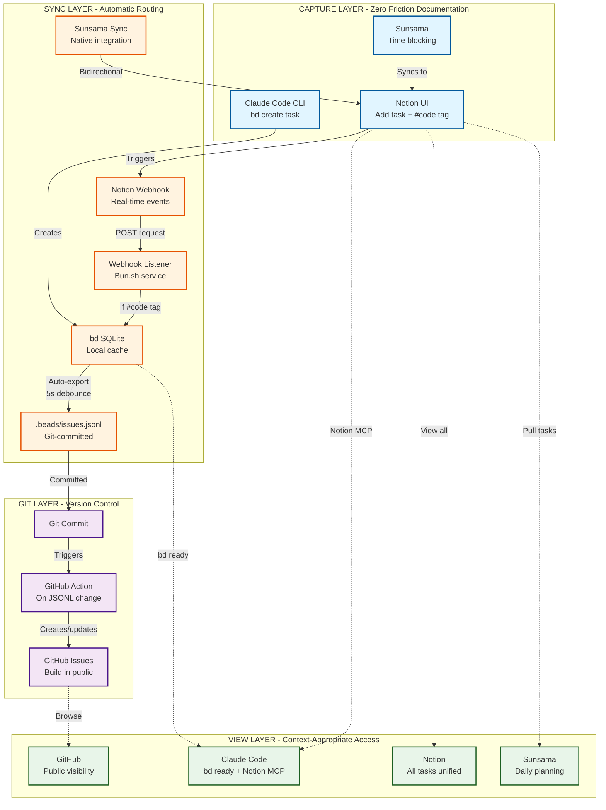
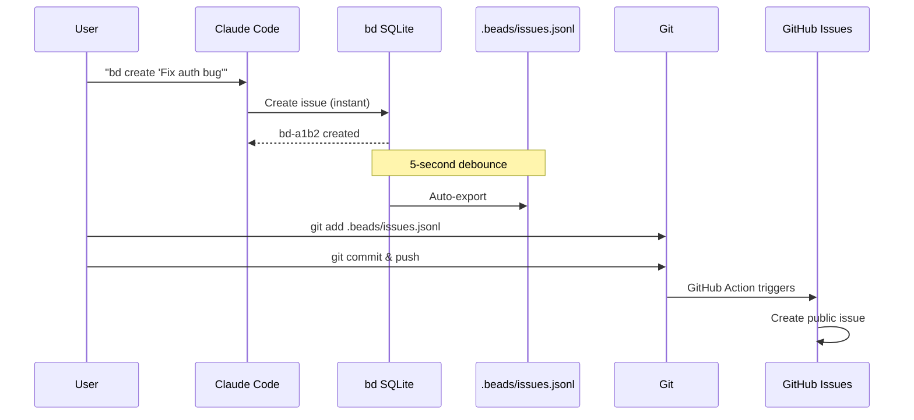
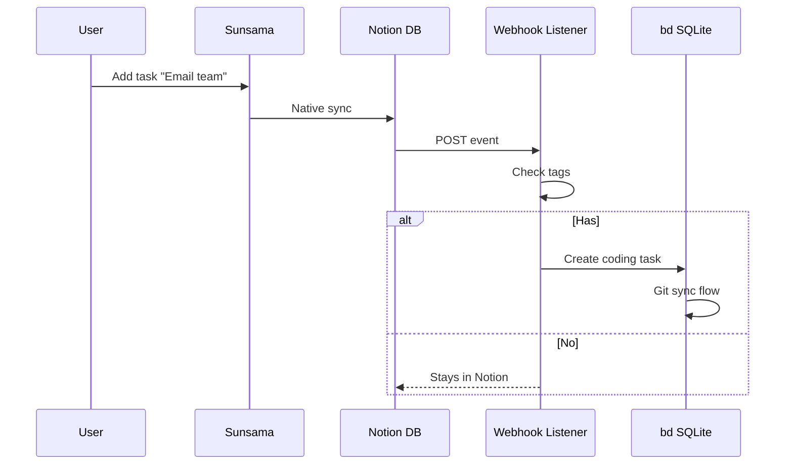

# Task Management Architecture

## System Overview

Event-driven, multi-context task capture with automatic routing and git-backed coding tasks.

## Architecture Diagram

## Data Flow by Task Type

### Coding Tasks (Git-Backed)

### Non-Coding Tasks (Notion-First)

## Key Architectural Decisions

### 1. Tag-Based Routing
- **`#code` tag** → Routes to bd (git-backed)
- **No tag** → Stays in Notion/Sunsama
- **Solves**: Automatic categorization without manual sorting

### 2. Event-Driven Sync
- **Notion webhooks** → Real-time (sub-500ms)
- **bd auto-export** → 5-second debounce (configurable)
- **Solves**: No polling, no startup delays

### 3. Capture Anywhere
- **Claude**: `bd create` (CLI-native)
- **Notion**: Add task (visual interface)
- **Sunsama**: Time blocking (ADHD-friendly)
- **Solves**: "I forget to document" → Zero friction capture

### 4. Git as Source of Truth (Coding Only)
- **bd issues** → Version controlled in `.beads/issues.jsonl`
- **Notion tasks** → Stay in Notion (not git)
- **Solves**: Coding tasks have full git history

## Token Efficiency

| Operation | Tokens | Method |
|-----------|--------|--------|
| Create task in Claude | ~50 | `bd create` (local, no LLM) |
| View ready tasks | ~200 | `bd ready` (local query) |
| Sync to Notion | ~0 | Webhook (background) |
| View all tasks | ~3K | Notion MCP (on demand) |

**Total per session**: ~3,500 tokens (vs 60K-300K for full MCP sync)

## Implementation Status

- [x] Phase 0: Architecture design
- [x] Phase 1a: Project setup with git
- [x] Phase 1b: bd initialization with hooks
- [ ] Phase 1c: Test bd workflow
- [ ] Phase 2: Notion webhook listener
- [ ] Phase 3: GitHub Action for public issues
- [ ] Phase 4: Claude Code startup integration

---

**Created**: 2025-01-18
**Architecture**: Event-driven, multi-context capture
**Primary Goal**: Eliminate "forgetting to document tasks"
