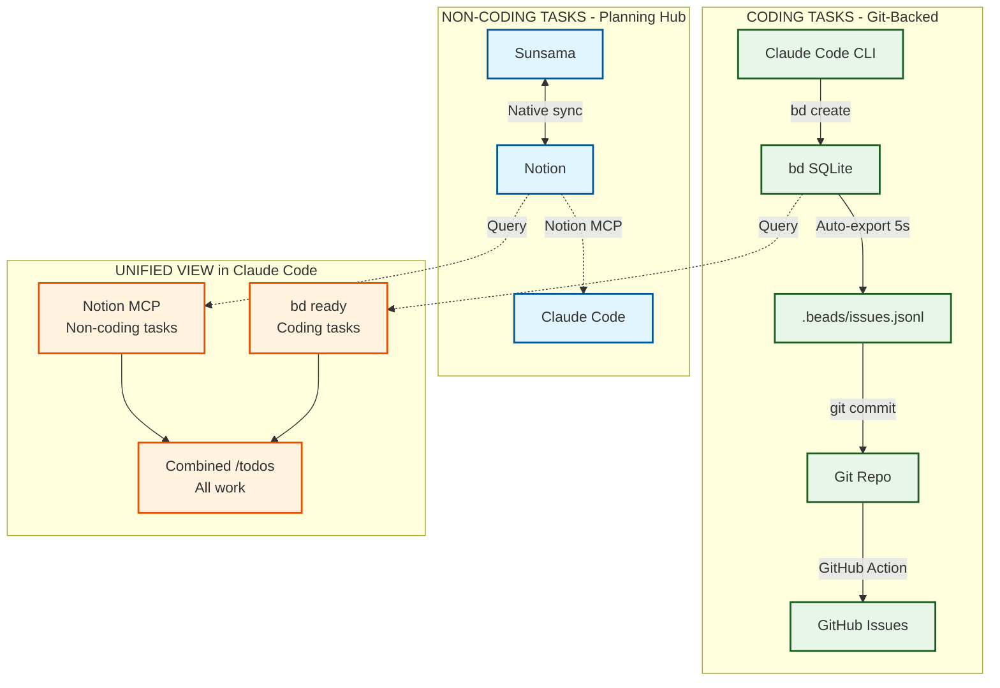

# Simplified Task Management Architecture

## Core Principle

**Two separate systems for two different needs:**
- **Coding tasks** → bd (git-backed, version-controlled)
- **Non-coding tasks** → Sunsama/Notion (planning, time-blocking)

**No complex sync. No webhooks. Just use the right tool for each job.**

## System Architecture



## Workflow by Context

### In Claude Code (Coding Work)

```bash
# Create coding task
bd create "Fix authentication bug" -p 0 -l bug,security

# View unblocked coding work
bd ready

# Update task status
bd update task-sync-system-abc --status in_progress

# Close when done
bd close task-sync-system-abc

# Git sync (automatic via hooks)
git add .beads/beads.left.jsonl
git commit -m "Fix auth bug"
git push
```

**Result**: Coding tasks are version-controlled, tied to commits, visible in GitHub Issues.

---

### In Sunsama (Daily Planning)

```
1. Time block your day
2. Pull tasks from Notion, Gmail, GitHub, etc.
3. Work on tasks (Sunsama tracks time)
4. Complete tasks → Syncs back to sources
```

**Result**: Non-coding tasks managed with ADHD-friendly time blocking.

---

### In Notion (Task Database)

```
1. Add task to "Tasks" database
2. Sunsama syncs it automatically
3. Claude can query via Notion MCP
```

**Result**: Central repository for all non-coding tasks.

---

### In Claude Code (View Everything)

```bash
# Option 1: Manual query
"Hey Claude, what's in my Notion tasks?"
→ Uses Notion MCP to search/list

# Option 2: Startup sync (already configured)
/sync-notion
→ Loads Notion tasks into /todos

# Option 3: Combined view
bd ready          # Coding tasks
/sync-notion      # Non-coding tasks
→ See everything in one place
```

**Result**: Unified view when needed, separate systems when focused.

## Why This Works

### For Coding Tasks

**bd is perfect because:**
- ✅ Git-backed (version controlled with code)
- ✅ Dependency tracking (task A blocks task B)
- ✅ Fast local queries (no API calls)
- ✅ CLI-native (zero friction in Claude Code)
- ✅ Survives across sessions (persistent memory)

**Use bd when:**
- Writing code
- Tracking bugs/features
- Planning technical work
- Need git history of decisions

---

### For Non-Coding Tasks

**Sunsama + Notion is perfect because:**
- ✅ ADHD-friendly time blocking
- ✅ Visual interface (easier for planning)
- ✅ Native integrations (Gmail, Calendar, etc.)
- ✅ Cross-device (mobile, web, desktop)
- ✅ Already in your workflow

**Use Sunsama/Notion when:**
- Daily planning
- Email follow-ups
- Meeting prep
- General life tasks
- Need time tracking

---

### The Bridge: Notion MCP

**When you need both in Claude:**

```javascript
// Claude can query Notion on demand
mcp__notion__notion-search({
  query: "urgent tasks",
  filters: { status: "Not started" }
})

// Or load into /todos
/sync-notion
```

**Cost**: ~3K tokens (only when you ask)
**Benefit**: Access everything without complex sync

## What We Removed (And Why)

| Removed | Why | Alternative |
|---------|-----|-------------|
| ❌ Webhooks | Overkill for solo use | Manual sync or MCP queries |
| ❌ Real-time sync | Don't need <500ms latency | Startup hook (already have) |
| ❌ Bidirectional Notion↔bd | Different purposes | Keep separate |
| ❌ GitHub Issues webhook | Adds complexity | GitHub Action (simpler) |
| ❌ Tag-based routing | Over-engineered | Use right tool consciously |

## Token Efficiency

| Operation | Tokens | Frequency |
|-----------|--------|-----------|
| `bd create` | ~50 | Every coding task |
| `bd ready` | ~200 | Start of session |
| `/sync-notion` | ~3K | When you want it |
| Notion MCP query | ~2-5K | Ad-hoc queries |

**Total per session**: 3-8K tokens (vs 60K-300K for complex sync)

## Implementation Status

- [x] **Phase 1**: bd setup with git hooks ✓
- [x] **Keep existing**: Notion sync (startup hook) ✓
- [ ] **Optional**: Integrate bd into startup hook
- [ ] **Optional**: GitHub Action for Issues
- [x] **Removed**: Webhook complexity ✓

## Daily Workflow

### Morning (Planning)

1. Open Sunsama
2. Time block your day
3. Pull tasks from Notion, Gmail, etc.
4. Identify coding vs non-coding work

### Coding Session (In Claude Code)

```bash
# See coding work
bd ready

# Create new tasks as you discover them
bd create "Add rate limiting" -l feature

# Work on task
bd update task-sync-system-xyz --status in_progress

# Commit when done
git add .beads/beads.left.jsonl
git commit -m "Add rate limiting"
bd close task-sync-system-xyz
```

### End of Day (Review)

1. Close completed tasks in Sunsama
2. Review bd for tomorrow: `bd list --status open`
3. Plan next day in Sunsama

## When to Use What

| Scenario | Tool | Reason |
|----------|------|--------|
| Fix a bug | **bd** | Code-related, needs git history |
| Email follow-up | **Sunsama** | Non-coding, time-sensitive |
| Plan feature | **bd** | Technical, may have dependencies |
| Schedule meeting | **Sunsama** | Calendar integration |
| Document TODO in code | **bd** | Coding task |
| Life admin task | **Notion** | Not urgent, organize later |
| "What should I work on?" | **bd ready** | Shows unblocked coding work |
| "What's my day look like?" | **Sunsama** | Shows time blocks |

## The Key Insight

**You don't need everything synced everywhere.**

- Coding tasks live where code lives (git)
- Planning tasks live where planning happens (Sunsama)
- Claude can access both when needed

**Simple. Maintainable. Fits your actual workflow.**

---

**Last Updated**: 2025-01-18
**Architecture**: Simplified, two-system approach
**Complexity**: Minimal (no webhooks, no complex sync)
